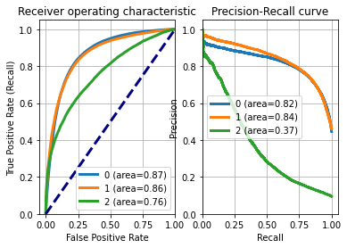
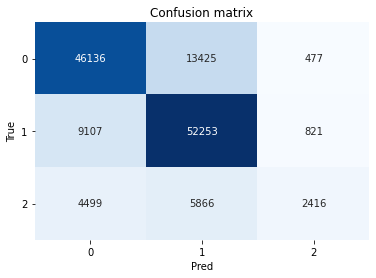

# NLP-GitHub-Bug-Prediction-GoogleBERT
Applying NLP techniques on Embold's github dataset and deploying Google's distilBERT model for classification.

# Overview
Developed a model using NLP (Python) with Google’s pretrained [distilBERT](https://huggingface.co/transformers/model_doc/distilbert.html) .
The  dataset used has been taken from [MachineHack’s](https://www.machinehack.com/hackathons/predict_github_issues_embold_sponsored_hackathon/overview) Bug Prediction Dataset which was preprocessed using regex and NLTK python libraries. 

# Features
- feature extraction from raw text using TF-IDF, CountVectorizer
-	using word embeddings to represent words as vectors using Word2Vec, Gensim.
- visualizing Data using TSNE algorithm, Plotly-express' sunburst treemaps.
- optimizing accuracy score as a metric to generalize well on unseen data.

# Dataset Description:
Train.json - 150000 rows x 3 columns (Includes label Column as Target variable)
Test.json - 30000 rows x 2 columns
Train_extra.json - 300000 rows x 3 columns (Includes label Column as Target variable)
Getting a code quality score using the Embold Code Analysis platform for Evaluation.

### Attribute Decription:
Title - the title of the GitHub bug, feature, question  
Body - the body of the GitHub bug, feature, question  
Label - Represents various classes of Labels

- Bug - 0
- Feature - 1
- Question - 2

Performance metrics used : Confusion matrix, [AUC-ROC curve](https://scikit-learn.org/stable/modules/generated/sklearn.metrics.roc_auc_score.html) 

# Images
##### AUC-ROC curve

##### Confusion Matrix

# Visualization

    Figure: Visualizing data using Plotly-express'sunburst treemaps

#### Project By:
- [Devansh Kaushik](https://www.linkedin.com/in/devansh-kaushik-b5912b174/)
- [Diwakar Srivastava](https://github.com/Diwakar012)
